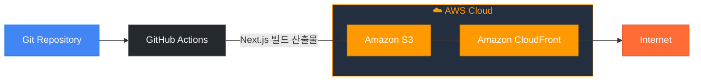

# 🚀 Next.js S3 + CloudFront 배포 자동화

이 프로젝트는 **GitHub Actions**을 사용하여 Next.js 애플리케이션을 **S3**에 배포하고, **CloudFront** 캐시를 무효화하는 CI/CD 파이프라인입니다.

---

## 📌 주요 링크

- **S3 버킷 웹사이트 엔드포인트**:  
  http://hanghae-ktg5679.s3-website.ap-northeast-2.amazonaws.com/

- **CloudFront 배포 도메인 이름**:  
  https://d36r12aazelmlq.cloudfront.net/

---

## 💡 주요 개념

| 개념                                 | 설명                                                                                                            |
| ------------------------------------ | --------------------------------------------------------------------------------------------------------------- |
| **GitHub Actions과 CI/CD 도구**      | 코드를 push할 때마다 자동으로 빌드·배포를 실행하는 **자동화된 워크플로우** 도구입니다.                          |
| **S3와 스토리지**                    | 빌드된 정적 파일을 저장·호스팅할 수 있는 **Amazon의 스토리지 서비스**입니다.                                    |
| **CloudFront와 CDN**                 | 전 세계 사용자에게 정적 콘텐츠를 **빠르고 안전하게 제공**하는 Amazon의 CDN(Content Delivery Network)입니다.     |
| **캐시 무효화 (Cache Invalidation)** | CloudFront가 **최신 빌드 파일**을 제공할 수 있도록, **기존 캐시를 비워주는 작업**입니다.                        |
| **Repository secret과 환경변수**     | GitHub에서 **AWS 키나 버킷 정보**를 안전하게 관리하기 위해 `Settings > Secrets`에 등록하는 **보안 정보**입니다. |

---

## ⚙️ 배포 자동화 워크플로우 개요

1. **GitHub Actions**가 push나 수동 실행을 감지
2. **의존성 설치**: `npm ci`
3. **빌드**: `npm run build`
4. **S3 업로드**: 빌드 결과물을 S3에 동기화
5. **CloudFront 캐시 무효화**: 사용자에게 최신 빌드 제공

---

## 🛠️ 설정 방법

1. **Secrets**에 아래 값들을 등록:

   - `AWS_ACCESS_KEY_ID`
   - `AWS_SECRET_ACCESS_KEY`
   - `AWS_REGION`
   - `S3_BUCKET_NAME`
   - `CLOUDFRONT_DISTRIBUTION_ID`

2. `.github/workflows/deploy.yml`에 맞춰 자동화 설정!
