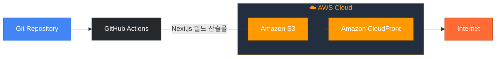
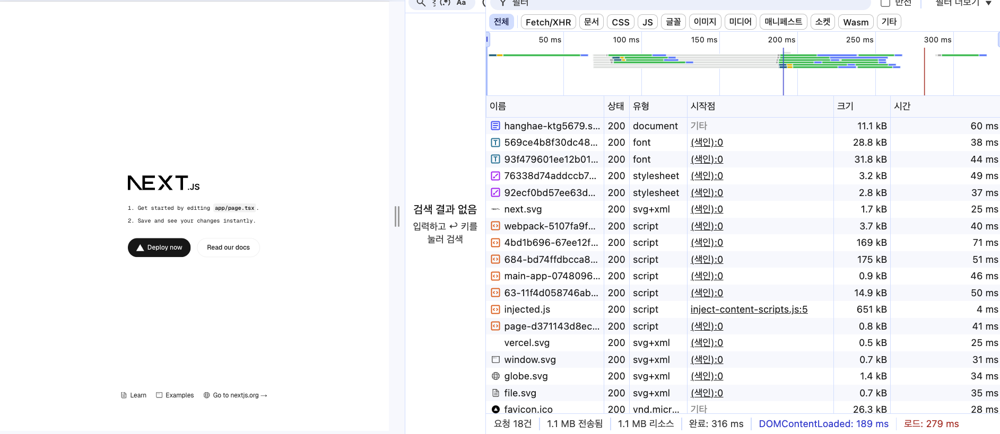
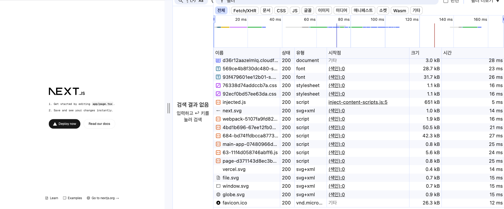

# 🚀 Next.js S3 + CloudFront 배포 자동화

이 프로젝트는 **GitHub Actions**을 사용하여 Next.js 애플리케이션을 **S3**에 배포하고, **CloudFront** 캐시를 무효화하는 CI/CD 파이프라인입니다.

---

## 📌 주요 링크

- **S3 버킷 웹사이트 엔드포인트**:  
  http://hanghae-ktg5679.s3-website.ap-northeast-2.amazonaws.com/

- **CloudFront 배포 도메인 이름**:  
  https://d36r12aazelmlq.cloudfront.net/

---

## 💡 주요 개념

| 개념                                 | 설명                                                                                                            |
| ------------------------------------ | --------------------------------------------------------------------------------------------------------------- |
| **GitHub Actions과 CI/CD 도구**      | 코드를 push할 때마다 자동으로 빌드·배포를 실행하는 **자동화된 워크플로우** 도구입니다.                          |
| **S3와 스토리지**                    | 빌드된 정적 파일을 저장·호스팅할 수 있는 **Amazon의 스토리지 서비스**입니다.                                    |
| **CloudFront와 CDN**                 | 전 세계 사용자에게 정적 콘텐츠를 **빠르고 안전하게 제공**하는 Amazon의 CDN(Content Delivery Network)입니다.     |
| **캐시 무효화 (Cache Invalidation)** | CloudFront가 **최신 빌드 파일**을 제공할 수 있도록, **기존 캐시를 비워주는 작업**입니다.                        |
| **Repository secret과 환경변수**     | GitHub에서 **AWS 키나 버킷 정보**를 안전하게 관리하기 위해 `Settings > Secrets`에 등록하는 **보안 정보**입니다. |

---

## ⚙️ 배포 자동화 워크플로우 개요

1. **GitHub Actions**가 push나 수동 실행을 감지
2. **의존성 설치**: `npm ci`
3. **빌드**: `npm run build`
4. **S3 업로드**: 빌드 결과물을 S3에 동기화
5. **CloudFront 캐시 무효화**: 사용자에게 최신 빌드 제공

---

## 🛠️ 설정 방법

1. **Secrets**에 아래 값들을 등록:

   - `AWS_ACCESS_KEY_ID`
   - `AWS_SECRET_ACCESS_KEY`
   - `AWS_REGION`
   - `S3_BUCKET_NAME`
   - `CLOUDFRONT_DISTRIBUTION_ID`

2. `.github/workflows/deploy.yml`에 맞춰 자동화 설정!

# 🚀 CDN 성능 개선 보고서

이번에는 **S3 버킷 직접 접속 vs CloudFront CDN을 통한 접속**의 성능 차이를 비교했습니다.  
테스트 페이지는 Next.js 정적 페이지이며, **Chrome 개발자 도구의 네트워크 탭**으로 측정했습니다.

---

## 📌 테스트 개요

- **환경**: MacOS / Chrome 최신 버전
- **테스트 페이지**: Next.js 기본 페이지
- **측정 항목**: 로딩 시간, 네트워크 요청 수, 주요 자원 크기
- **테스트 방법**: S3 웹사이트 엔드포인트 URL과 CloudFront 배포 도메인을 각각 접속하여 비교

---

## ⚙️ 테스트 결과 (비교표)

| 항목                           | S3 웹사이트 엔드포인트 | CloudFront CDN  |
| ------------------------------ | ---------------------- | --------------- |
| **총 요청 수**                 | 18건                   | 18건            |
| **전송된 데이터**              | 1.1 MB                 | 1.1 MB          |
| **로드 완료 시간** (Load)      | 316 ms                 | 160 ms          |
| **DOMContentLoaded**           | 189 ms                 | 120 ms          |
| **최대 JS/스크립트 로딩 시간** | ~71 ms                 | ~27 ms          |
| **HTML 첫 응답 시간**          | 60 ms                  | 28 ms           |
| **전체 응답 속도**             | 대체로 25~71 ms        | 대부분 12~28 ms |

---

## 📊 주요 개선점 요약

✅ **로드 완료 시간 316 ms → 160 ms** (약 49% 개선)  
✅ **HTML 첫 응답 시간 60 ms → 28 ms** (약 53% 개선)  
✅ **각 요청 응답 속도가 전반적으로 빨라짐**  
✅ CDN 캐시를 활용해 **전세계 사용자에게 더 빠른 응답 제공** 가능

---

## 📈 네트워크 요청 스크린샷

| S3 웹사이트 엔드포인트          | CloudFront CDN 배포 도메인                  |
| ------------------------------- | ------------------------------------------- |
|  |  |

---

## ✏️ 결론

- CloudFront CDN을 통해 **정적 리소스 로딩 속도**와 **전체 페이지 응답 시간**이 명확히 향상되었습니다.
- CDN의 전세계 엣지 서버를 통해 더 빠르고 일관된 사용자 경험을 제공합니다.
- 다음 단계로는 이미지 최적화, 캐시 정책 개선 등을 추가로 고려해볼 수 있습니다.

---
